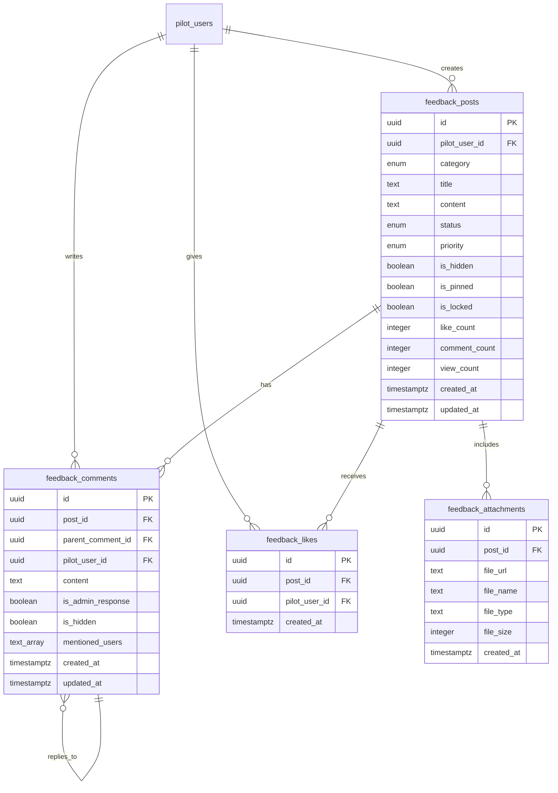

# feat: Add pilot feedback and discussion platform with social features

## Overview

Implement a Facebook-style feedback and discussion platform where pilots can share operational suggestions, report issues, and engage in collaborative discussions. The feature includes social interactions (likes, comments, @mentions), categorization, moderation tools, and a familiar social media UX.

## Problem Statement / Motivation

**Current Situation:**
- Pilots have no structured way to provide feedback or suggestions to fleet management
- Operational issues and safety concerns are communicated through informal channels (email, phone)
- No visibility into what other pilots are experiencing or suggesting
- Management lacks a centralized system to track, prioritize, and respond to pilot feedback

**Impact:**
- Valuable operational insights are lost or not acted upon
- Pilots feel disconnected from decision-making processes
- Similar issues are reported multiple times without awareness
- No way to gauge consensus or importance of issues through peer validation

**User Needs:**
- Pilots want a voice in operational improvements
- Need to share experiences and learn from each other
- Want visibility into which issues are being addressed
- Desire professional, organized communication channel

## Proposed Solution

A dedicated feedback platform with familiar social media patterns that encourages engagement while maintaining professional aviation standards.

### Core Components

1. **Feedback Posts** - Create, view, and manage discussion threads
2. **Social Interactions** - Likes and threaded comments for engagement
3. **@Mentions** - Tag colleagues and admins for direct engagement
4. **Categorization** - Organize by type (Operational, Safety, Suggestions, Schedule, Equipment, General)
5. **Moderation Tools** - Admin capabilities for content management and issue tracking
6. **Status Tracking** - Follow issues from submission to resolution

## Technical Approach

### Architecture

**Service Layer Pattern** (follows project convention):
- All database operations through `lib/services/feedback-service.ts`
- No direct Supabase calls from components
- TypeScript interfaces for type safety
- Comprehensive error handling

**Database Schema:**



### Database Tables

**feedback_posts**
```sql
CREATE TABLE feedback_posts (
    id UUID PRIMARY KEY DEFAULT gen_random_uuid(),
    pilot_user_id UUID NOT NULL REFERENCES pilot_users(id) ON DELETE CASCADE,
    category TEXT NOT NULL CHECK (category IN ('operational', 'safety', 'suggestion', 'schedule', 'equipment', 'general')),
    title TEXT NOT NULL CHECK (length(title) >= 5 AND length(title) <= 200),
    content TEXT NOT NULL CHECK (length(content) >= 10),
    status TEXT NOT NULL DEFAULT 'new' CHECK (status IN ('new', 'under_review', 'in_progress', 'resolved', 'implemented')),
    priority TEXT DEFAULT 'medium' CHECK (priority IN ('low', 'medium', 'high', 'critical')),
    is_hidden BOOLEAN DEFAULT false,
    is_pinned BOOLEAN DEFAULT false,
    is_locked BOOLEAN DEFAULT false,
    like_count INTEGER DEFAULT 0,
    comment_count INTEGER DEFAULT 0,
    view_count INTEGER DEFAULT 0,
    created_at TIMESTAMPTZ DEFAULT NOW(),
    updated_at TIMESTAMPTZ DEFAULT NOW()
);

CREATE INDEX idx_feedback_posts_category ON feedback_posts(category);
CREATE INDEX idx_feedback_posts_status ON feedback_posts(status);
CREATE INDEX idx_feedback_posts_created_at ON feedback_posts(created_at DESC);
CREATE INDEX idx_feedback_posts_trending ON feedback_posts(like_count DESC, comment_count DESC, created_at DESC);
```

**feedback_comments**
```sql
CREATE TABLE feedback_comments (
    id UUID PRIMARY KEY DEFAULT gen_random_uuid(),
    post_id UUID NOT NULL REFERENCES feedback_posts(id) ON DELETE CASCADE,
    parent_comment_id UUID REFERENCES feedback_comments(id) ON DELETE CASCADE,
    pilot_user_id UUID NOT NULL REFERENCES pilot_users(id) ON DELETE CASCADE,
    content TEXT NOT NULL CHECK (length(content) >= 1),
    is_admin_response BOOLEAN DEFAULT false,
    is_hidden BOOLEAN DEFAULT false,
    mentioned_users TEXT[] DEFAULT '{}',
    created_at TIMESTAMPTZ DEFAULT NOW(),
    updated_at TIMESTAMPTZ DEFAULT NOW()
);

CREATE INDEX idx_feedback_comments_post_id ON feedback_comments(post_id);
CREATE INDEX idx_feedback_comments_parent ON feedback_comments(parent_comment_id);
```

**feedback_likes**
```sql
CREATE TABLE feedback_likes (
    id UUID PRIMARY KEY DEFAULT gen_random_uuid(),
    post_id UUID NOT NULL REFERENCES feedback_posts(id) ON DELETE CASCADE,
    pilot_user_id UUID NOT NULL REFERENCES pilot_users(id) ON DELETE CASCADE,
    created_at TIMESTAMPTZ DEFAULT NOW(),
    UNIQUE(post_id, pilot_user_id)
);

CREATE INDEX idx_feedback_likes_post_id ON feedback_likes(post_id);
```

**feedback_attachments**
```sql
CREATE TABLE feedback_attachments (
    id UUID PRIMARY KEY DEFAULT gen_random_uuid(),
    post_id UUID NOT NULL REFERENCES feedback_posts(id) ON DELETE CASCADE,
    file_url TEXT NOT NULL,
    file_name TEXT NOT NULL,
    file_type TEXT NOT NULL,
    file_size INTEGER NOT NULL,
    created_at TIMESTAMPTZ DEFAULT NOW()
);
```

### Row Level Security Policies

```sql
-- Enable RLS
ALTER TABLE feedback_posts ENABLE ROW LEVEL SECURITY;
ALTER TABLE feedback_comments ENABLE ROW LEVEL SECURITY;
ALTER TABLE feedback_likes ENABLE ROW LEVEL SECURITY;

-- Pilots can view non-hidden posts
CREATE POLICY "Pilots view public posts"
ON feedback_posts FOR SELECT
TO authenticated
USING (is_hidden = false OR pilot_user_id = auth.uid());

-- Pilots can create posts
CREATE POLICY "Pilots create posts"
ON feedback_posts FOR INSERT
TO authenticated
WITH CHECK (pilot_user_id = auth.uid());

-- Pilots can edit own posts (unless locked)
CREATE POLICY "Pilots edit own posts"
ON feedback_posts FOR UPDATE
TO authenticated
USING (pilot_user_id = auth.uid() AND is_locked = false);

-- Admins can manage all posts
CREATE POLICY "Admins manage all posts"
ON feedback_posts FOR ALL
TO authenticated
USING (
    EXISTS (
        SELECT 1 FROM an_users
        WHERE id = auth.uid() AND role = 'admin'
    )
);

-- Similar policies for comments and likes
```

### Database Triggers

```sql
-- Update like_count when likes change
CREATE OR REPLACE FUNCTION update_post_like_count()
RETURNS TRIGGER AS $$
BEGIN
    IF TG_OP = 'INSERT' THEN
        UPDATE feedback_posts
        SET like_count = like_count + 1
        WHERE id = NEW.post_id;
    ELSIF TG_OP = 'DELETE' THEN
        UPDATE feedback_posts
        SET like_count = like_count - 1
        WHERE id = OLD.post_id;
    END IF;
    RETURN NULL;
END;
$$ LANGUAGE plpgsql;

CREATE TRIGGER trigger_update_like_count
AFTER INSERT OR DELETE ON feedback_likes
FOR EACH ROW EXECUTE FUNCTION update_post_like_count();

-- Update comment_count when comments change
CREATE OR REPLACE FUNCTION update_post_comment_count()
RETURNS TRIGGER AS $$
BEGIN
    IF TG_OP = 'INSERT' THEN
        UPDATE feedback_posts
        SET comment_count = comment_count + 1
        WHERE id = NEW.post_id;
    ELSIF TG_OP = 'DELETE' THEN
        UPDATE feedback_posts
        SET comment_count = comment_count - 1
        WHERE id = OLD.post_id;
    END IF;
    RETURN NULL;
END;
$$ LANGUAGE plpgsql;

CREATE TRIGGER trigger_update_comment_count
AFTER INSERT OR DELETE ON feedback_comments
FOR EACH ROW EXECUTE FUNCTION update_post_comment_count();
```

## Implementation Phases

### Phase 1: Database & Service Layer (Week 1)

**Database Setup:**
- [ ] Create migration file: `supabase/migrations/YYYYMMDD_create_feedback_tables.sql`
- [ ] Create all 4 tables with constraints
- [ ] Add indexes for performance
- [ ] Set up RLS policies
- [ ] Create database triggers for counts
- [ ] Set up Supabase Storage bucket `feedback-attachments`

**Service Layer:**
- [ ] Create `lib/services/feedback-service.ts`
  - `getFeedbackPosts(filters)` - Get posts with pagination, filters
  - `getTrendingPosts(limit)` - Algorithm for trending posts
  - `getPostById(postId)` - Single post with comments
  - `createPost(postData)` - Create new post
  - `updatePost(postId, updates)` - Update post
  - `deletePost(postId)` - Soft delete (set is_hidden)
  - `toggleLike(postId, userId)` - Like/unlike post
  - `createComment(postData)` - Add comment
  - `updateComment(commentId, content)` - Edit comment
  - `deleteComment(commentId)` - Delete comment
  - `updatePostStatus(postId, status, priority)` - Admin only
  - `pinPost(postId)` - Admin only
  - `lockPost(postId)` - Admin only

**Testing:**
- [ ] Test service functions with sample data
- [ ] Verify RLS policies block unauthorized access
- [ ] Test triggers update counts correctly

**Estimated Effort:** 5-7 days

### Phase 2: Pilot Portal Feed (Week 2)

**Pages:**
- [ ] Create `app/portal/feedback/page.tsx`
  - Main feed with infinite scroll
  - Filter sidebar (category, status, trending)
  - Create post button
- [ ] Create `app/portal/feedback/[id]/page.tsx`
  - Single post detail view
  - Full comment thread
  - Like/comment actions

**Components:**
- [ ] `components/feedback/post-card.tsx`
  - Facebook-style post card
  - Pilot avatar, name, rank, timestamp
  - Post title and content (with "Read more" expansion)
  - Category and status badges
  - Like button with count
  - Comment button with count
- [ ] `components/feedback/create-post-modal.tsx`
  - Modal dialog with form (React Hook Form + Zod)
  - Title input (5-200 characters)
  - Content textarea (10+ characters)
  - Category selector
  - File upload (optional, max 10MB)
- [ ] `components/feedback/like-button.tsx`
  - Heart icon with fill animation
  - Optimistic updates
  - Like count display
- [ ] `components/feedback/filter-sidebar.tsx`
  - Category filters
  - Status filters
  - "My Posts" toggle
  - "Trending" toggle

**Testing:**
- [ ] Playwright E2E test: Create post
- [ ] Playwright E2E test: Like post
- [ ] Playwright E2E test: Filter feed
- [ ] Storybook stories for all components

**Estimated Effort:** 7-10 days

### Phase 3: Comments & @Mentions (Week 3)

**Components:**
- [ ] `components/feedback/comment-thread.tsx`
  - Nested comment display (max 3 levels)
  - Reply functionality
  - @mention highlighting
  - Admin response badge
  - Timestamp and author
- [ ] `components/feedback/mention-input.tsx`
  - Textarea with @mention autocomplete
  - Search pilot_users by name
  - Dropdown suggestion list
  - Insert @username on selection
- [ ] `components/feedback/mention-parser.tsx`
  - Parse @mentions from text
  - Highlight mentions
  - Link to pilot profiles

**Features:**
- [ ] Implement comment posting
- [ ] Implement nested replies
- [ ] Implement @mention autocomplete
- [ ] Store mentioned_users in comment record
- [ ] Real-time comment updates (Supabase subscriptions)

**Notifications:**
- [ ] Create notification when user is @mentioned
- [ ] Create notification when someone comments on your post
- [ ] Create notification when admin responds

**Testing:**
- [ ] E2E test: Post comment
- [ ] E2E test: Reply to comment
- [ ] E2E test: @mention autocomplete
- [ ] E2E test: Receive @mention notification

**Estimated Effort:** 5-7 days

### Phase 4: Admin Moderation & Analytics (Week 4)

**Pages:**
- [ ] Create `app/dashboard/feedback/page.tsx`
  - Admin view of all posts
  - Moderation queue (flagged posts)
  - Bulk actions toolbar
  - Analytics cards

**Components:**
- [ ] `components/feedback/moderation-toolbar.tsx`
  - Pin/unpin button
  - Lock/unlock button
  - Hide/show button
  - Delete button
  - Status selector
  - Priority selector
- [ ] `components/feedback/admin-analytics.tsx`
  - Posts by category (pie chart)
  - Posts by status (bar chart)
  - Average resolution time
  - Most active pilots
  - Trending topics

**Features:**
- [ ] Admin can update post status and priority
- [ ] Admin can pin important posts (appear at top of feed)
- [ ] Admin can lock posts (prevent new comments)
- [ ] Admin can hide posts (soft delete)
- [ ] Admin responses show with special badge
- [ ] Analytics dashboard with charts

**Testing:**
- [ ] E2E test: Admin updates post status
- [ ] E2E test: Admin pins post
- [ ] E2E test: Admin locks post
- [ ] E2E test: Analytics display correctly

**Estimated Effort:** 5-7 days

## Acceptance Criteria

### Functional Requirements

**Post Creation & Viewing:**
- [ ] Pilots can create posts with title (5-200 chars), content (10+ chars), and category
- [ ] Posts display in chronological feed with infinite scroll (20 per page)
- [ ] Post cards show pilot name, rank, timestamp, title, content preview, category badge, status badge
- [ ] "Read more" button expands full content if truncated
- [ ] Single post page shows full content and comment thread

**Social Interactions:**
- [ ] Pilots can like posts (heart icon with count)
- [ ] Clicking like toggles on/off (optimistic update)
- [ ] Pilots can comment on posts
- [ ] Comments support nested replies (max 3 levels deep)
- [ ] Comment count displays on post card

**@Mentions:**
- [ ] Typing @ in comment triggers autocomplete dropdown
- [ ] Autocomplete searches pilot_users by first_name and last_name
- [ ] Selecting suggestion inserts @FirstName LastName
- [ ] @mentions are highlighted in blue and clickable
- [ ] @mentioned pilots receive notification

**Categorization & Filtering:**
- [ ] Posts have category: Operational Issues, Safety Concerns, Suggestions, Schedule Feedback, Equipment, General Discussion
- [ ] Filter sidebar allows filtering by category
- [ ] Filter by status: New, Under Review, In Progress, Resolved, Implemented
- [ ] "My Posts" toggle shows only current pilot's posts
- [ ] "Trending" toggle sorts by (like_count + comment_count + recent activity)

**Moderation (Admin Only):**
- [ ] Admins see moderation toolbar on all posts
- [ ] Admins can update status: New → Under Review → In Progress → Resolved/Implemented
- [ ] Admins can set priority: Low, Medium, High, Critical
- [ ] Admins can pin posts (appear at top of feed with pin icon)
- [ ] Admins can lock posts (prevents new comments, shows lock icon)
- [ ] Admins can hide posts (soft delete, not visible to pilots)
- [ ] Admin responses show with special "Admin" badge and different background color
- [ ] Admin dashboard shows all posts with bulk action capabilities

**Notifications:**
- [ ] Notification when someone @mentions you
- [ ] Notification when someone comments on your post
- [ ] Notification when admin responds to your post
- [ ] Notification when status changes on your post

### Non-Functional Requirements

**Performance:**
- [ ] Feed initial load <2 seconds
- [ ] Infinite scroll pagination loads smoothly
- [ ] Like action provides instant feedback (optimistic update)
- [ ] Image uploads <5 seconds for files up to 10MB

**Security:**
- [ ] RLS policies prevent unauthorized data access
- [ ] Pilots can only edit/delete own posts (unless admin)
- [ ] Admins require admin role to access moderation features
- [ ] File uploads validated for type and size
- [ ] XSS protection on user-generated content

**Accessibility:**
- [ ] WCAG 2.1 AA compliant
- [ ] Keyboard navigation works for all interactions
- [ ] Screen reader announces post content, likes, comments
- [ ] High contrast mode supported
- [ ] Focus indicators visible

**Mobile Responsiveness:**
- [ ] Works on tablets (768px+)
- [ ] Works on mobile phones (320px+)
- [ ] Touch-friendly targets (44px minimum)
- [ ] Responsive grid layout

### Quality Gates

**Testing:**
- [ ] E2E tests for post CRUD operations
- [ ] E2E tests for liking and commenting
- [ ] E2E tests for @mentions
- [ ] E2E tests for admin moderation
- [ ] Unit tests for @mention parsing logic
- [ ] Unit tests for trending algorithm
- [ ] Storybook stories for all components

**Code Quality:**
- [ ] TypeScript strict mode with no `any` types
- [ ] ESLint passes with no errors
- [ ] Prettier formatting applied
- [ ] Code review approval from senior developer

**Documentation:**
- [ ] Update CLAUDE.md with feedback feature details
- [ ] Add feedback-service.ts documentation
- [ ] Create user guide for pilots
- [ ] Create admin guide for moderation

## Technical Considerations

### Performance Optimization

**Database Indexes:**
- Index on `category`, `status`, `created_at` for fast filtering
- Compound index on `(like_count DESC, comment_count DESC, created_at DESC)` for trending
- Index on `pilot_user_id` for "My Posts" filter

**Materialized Counts:**
- Use database triggers to maintain `like_count` and `comment_count`
- Avoid COUNT(*) queries on large tables
- Update counts atomically on INSERT/DELETE

**Query Optimization:**
- Use pagination (limit 20 posts per page)
- Lazy load images and attachments
- Cache feed data with TanStack Query (5-minute stale time)
- Prefetch next page on scroll

**Real-time Subscriptions:**
```typescript
// Subscribe to new comments on current post
const channel = supabase
  .channel(`post:${postId}`)
  .on('postgres_changes', {
    event: 'INSERT',
    schema: 'public',
    table: 'feedback_comments',
    filter: `post_id=eq.${postId}`
  }, (payload) => {
    queryClient.setQueryData(['post', postId], (old) => ({
      ...old,
      comments: [...old.comments, payload.new]
    }))
  })
  .subscribe()

// Clean up on unmount
return () => channel.unsubscribe()
```

### Security Considerations

**Content Validation:**
- Sanitize user input to prevent XSS
- Validate title length (5-200 characters)
- Validate content length (10+ characters)
- Validate file uploads (type, size, virus scan if available)

**Rate Limiting:**
- Limit post creation to 10 per day per pilot
- Limit comment creation to 100 per day per pilot
- Implement cooldown period (30 seconds between posts)

**Audit Logging:**
- Log all moderation actions (who, what, when)
- Log status changes with admin ID
- Retain logs for 5+ years (compliance)

### @Mention Implementation

**Autocomplete Logic:**
```typescript
// components/feedback/mention-input.tsx
const [mentions, setMentions] = useState<PilotUser[]>([])
const [showDropdown, setShowDropdown] = useState(false)

const handleInput = async (e: React.ChangeEvent<HTMLTextAreaElement>) => {
  const value = e.target.value
  const cursorPos = e.target.selectionStart
  const textBeforeCursor = value.slice(0, cursorPos)
  const match = textBeforeCursor.match(/@(\w*)$/)

  if (match) {
    const query = match[1]
    const results = await searchPilots(query)
    setMentions(results)
    setShowDropdown(true)
  } else {
    setShowDropdown(false)
  }
}

const insertMention = (pilot: PilotUser) => {
  // Insert @FirstName LastName at cursor position
  // Store pilot.id in mentioned_users array
}
```

**Mention Parsing:**
```typescript
// Parse @mentions from text and highlight
function parseMentions(text: string) {
  return text.replace(/@(\w+\s\w+)/g, (match, name) => {
    return `<span class="text-blue-600 font-medium hover:underline cursor-pointer">${match}</span>`
  })
}
```

## Success Metrics

**Engagement Metrics:**
- 70%+ of active pilots create at least 1 post per month
- Average 5+ comments per post
- 80%+ of posts receive at least 1 like
- 50%+ of pilots visit feedback page weekly

**Response Metrics:**
- Admins respond to posts within 48 hours (avg)
- 80%+ of operational issues marked "Resolved" or "Implemented" within 30 days
- Admin response rate >90%

**User Satisfaction:**
- Post-deployment survey shows 4+/5 satisfaction rating
- Positive feedback from pilot focus groups
- Increased pilot engagement in fleet operations

## Dependencies & Prerequisites

**Existing Systems:**
- ✅ Pilot authentication system (`pilot_users` table)
- ✅ Admin authentication system (`an_users` table)
- ✅ Supabase database connection
- ✅ Service layer architecture established

**Required Setup:**
- 📋 Supabase Storage bucket for file attachments
- 📋 Notification system (can integrate existing or build new)
- 📋 Email templates for @mention notifications

**Third-party Services:**
- Supabase real-time subscriptions (already available)
- Supabase Storage (already available)

## Risk Analysis & Mitigation

| Risk | Impact | Probability | Mitigation |
|------|--------|-------------|------------|
| Inappropriate content posted | High | Medium | Implement moderation queue, hide/lock capabilities, clear community guidelines |
| Spam/abuse of @mentions | Medium | Low | Rate limiting, cooldown periods, report/flag system |
| Performance degradation with large datasets | Medium | Medium | Database indexes, pagination, query optimization, caching |
| RLS policy bypasses | High | Low | Comprehensive testing, security audit, regular policy reviews |
| Real-time subscription scalability | Medium | Low | Connection pooling, selective subscriptions, fallback to polling |

## Future Considerations

**Phase 2 Enhancements (Post-MVP):**
- Reaction emojis (like Facebook: 👍 ❤️ 😂 🤔 😮)
- Search functionality (full-text search across posts and comments)
- Email digest (weekly summary of top posts)
- Attach multiple images per post
- Edit history for transparency
- Sorting options (newest, oldest, most liked, most commented)
- Bookmark/save posts for later

**Integration Opportunities:**
- Link feedback posts to certification tracking (e.g., "Certifications mentioned in this discussion")
- Link to flight schedules (e.g., "Related to flight PX123")
- Integration with leave request system
- Analytics dashboard for management (trends, sentiment analysis)

## Documentation Plan

**User Documentation:**
- [ ] Add "Feedback & Discussion" section to pilot portal guide
- [ ] Create quick start guide with screenshots
- [ ] Document community guidelines and moderation policy

**Technical Documentation:**
- [ ] Update `/Users/skycruzer/Desktop/Fleet Office Management/fleet-management-v2/CLAUDE.md` with feedback feature architecture
- [ ] Document `feedback-service.ts` API with JSDoc comments
- [ ] Add database schema diagram to docs
- [ ] Create admin moderation guide

**Code Comments:**
- [ ] Service layer functions with @param and @returns
- [ ] Complex algorithms (trending, @mention parsing) with explanations
- [ ] RLS policies with purpose and security notes

## References & Research

### Internal References

**Service Layer Patterns:**
- `/lib/services/pilot-portal-service.ts` - Existing service architecture (503 lines)
- `/lib/services/admin-service.ts` - Admin operations patterns (312 lines)
- `/lib/services/leave-service.ts` - CRUD operations example

**Component Patterns:**
- `/app/portal/page.tsx` - Landing page layout (182 lines)
- `/app/dashboard/admin/page.tsx` - Admin dashboard structure (309 lines)
- `/components/ui/*` - shadcn/ui component library

**Database Conventions:**
- Table naming: `snake_case`
- Column naming: `snake_case`
- Enum values: lowercase strings
- Timestamps: `created_at`, `updated_at`

### External References

**Framework Documentation:**
- [Next.js 15 App Router](https://nextjs.org/docs/app)
- [Supabase Row Level Security](https://supabase.com/docs/guides/auth/row-level-security)
- [Supabase Real-time Subscriptions](https://supabase.com/docs/guides/realtime)
- [React Hook Form + Zod](https://react-hook-form.com/get-started#SchemaValidation)
- [shadcn/ui Components](https://ui.shadcn.com)

**Best Practices:**
- Facebook feed UX patterns
- Reddit comment threading
- Slack @mention functionality
- GitHub issue discussion patterns

### Project Documentation

**Comprehensive Research Completed:**
- Repository conventions analysis (555 lines in CLAUDE.md)
- Aviation industry best practices research
- Next.js 15 + Supabase authentication patterns
- React Hook Form + Zod validation strategies
- Real-time subscription implementation

**Related Features:**
- Pilot Portal (in progress)
- Leave Request System (planned)
- Flight Request System (planned)

---

## File Structure Overview

```
/Users/skycruzer/Desktop/Fleet Office Management/fleet-management-v2/

├── lib/services/
│   └── feedback-service.ts                    # NEW - 400+ lines
│
├── app/portal/feedback/
│   ├── page.tsx                               # NEW - Main feed
│   └── [id]/page.tsx                          # NEW - Post detail
│
├── app/dashboard/feedback/
│   └── page.tsx                               # NEW - Admin view
│
├── components/feedback/
│   ├── post-card.tsx                          # NEW
│   ├── create-post-modal.tsx                  # NEW
│   ├── like-button.tsx                        # NEW
│   ├── filter-sidebar.tsx                     # NEW
│   ├── comment-thread.tsx                     # NEW
│   ├── mention-input.tsx                      # NEW
│   ├── mention-parser.tsx                     # NEW
│   ├── moderation-toolbar.tsx                 # NEW
│   └── admin-analytics.tsx                    # NEW
│
├── supabase/migrations/
│   └── YYYYMMDD_create_feedback_tables.sql    # NEW
│
└── e2e/
    └── feedback.spec.ts                       # NEW - E2E tests
```

---

**Estimated Total Effort:** 3-4 weeks (1 week per phase)
**Complexity:** Medium-High
**Priority:** High (user-requested feature)
**Team:** 1-2 developers recommended

---

## Creating the GitHub Issue

To create this issue on GitHub, run:

```bash
gh issue create \
  --title "feat: Add pilot feedback and discussion platform with social features" \
  --body-file GITHUB_ISSUE_PILOT_FEEDBACK.md \
  --label "feature,enhancement,documentation"
```

Or manually create the issue and copy the content from this file.
