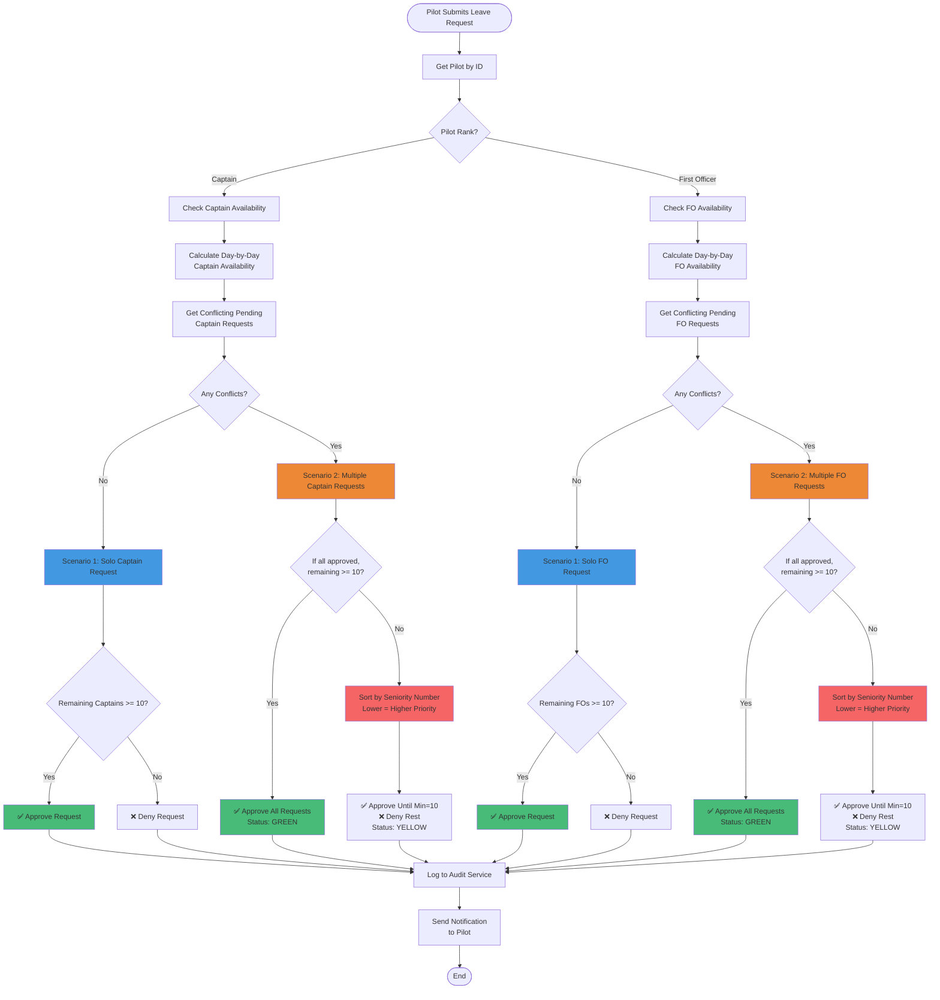

# Fleet Management V2 - Architecture Diagrams

**Version**: 2.0.0
**Last Updated**: October 27, 2025
**Author**: Maurice (Skycruzer)

This document contains visual architecture diagrams for Fleet Management V2 using Mermaid syntax.

---

## Table of Contents

1. [System Architecture Overview](#system-architecture-overview)
2. [Dual Authentication Flow](#dual-authentication-flow)
3. [Service Layer Architecture](#service-layer-architecture)
4. [Leave Eligibility Logic Flow](#leave-eligibility-logic-flow)
5. [API Request Flow](#api-request-flow)
6. [Database Schema Relationships](#database-schema-relationships)
7. [Component Hierarchy](#component-hierarchy)
8. [Deployment Architecture](#deployment-architecture)
9. [Data Flow Diagrams](#data-flow-diagrams)
10. [PWA Caching Strategy](#pwa-caching-strategy)

---

## System Architecture Overview


---

## Dual Authentication Flow

### Admin Portal Authentication (Supabase Auth)


### Pilot Portal Authentication (Custom Auth)


### Pilot Registration Flow


---

## Service Layer Architecture


### Service Implementation Pattern


---

## Leave Eligibility Logic Flow



### Rank-Separated Evaluation


---

## API Request Flow

### Complete Request Lifecycle


### Error Handling Flow


---

## Database Schema Relationships


### Database Views


---

## Component Hierarchy

### Admin Dashboard Structure


### Pilot Portal Structure

```mermaid
graph TB
    App[App Layout<br/>app/layout.tsx] --> Portal[Portal Layout<br/>app/portal/layout.tsx]

    Portal --> Public{Route Type}
    Public -->|Public| PubLayout[Public Layout<br/>app/portal/\(public\)/layout.tsx]
    Public -->|Protected| ProtLayout[Protected Layout<br/>app/portal/\(protected\)/layout.tsx]

    PubLayout --> Login[Login Page<br/>app/portal/login/page.tsx]
    PubLayout --> Register[Register Page<br/>app/portal/register/page.tsx]
    PubLayout --> Forgot[Forgot Password<br/>app/portal/forgot-password/page.tsx]

    Login --> LoginForm[Pilot Login Form<br/>components/pilot/PilotLoginForm.tsx]
    Register --> RegForm[Pilot Register Form<br/>components/pilot/PilotRegisterForm.tsx]

    ProtLayout --> PortalHeader[Portal Header<br/>Aviation Theme]
    ProtLayout --> PortalSidebar[Portal Sidebar<br/>components/layout/pilot-portal-sidebar.tsx]
    ProtLayout --> PortalContent[Page Content]

    PortalContent --> PDash[Portal Dashboard<br/>app/portal/dashboard/page.tsx]
    PortalContent --> PProfile[Profile<br/>app/portal/profile/page.tsx]
    PortalContent --> PCerts[Certifications<br/>app/portal/certifications/page.tsx]
    PortalContent --> PLeave[Leave Requests<br/>app/portal/leave-requests/page.tsx]
    PortalContent --> PFlight[Flight Requests<br/>app/portal/flight-requests/page.tsx]
    PortalContent --> PFeedback[Feedback<br/>app/portal/feedback/page.tsx]
    PortalContent --> PNotif[Notifications<br/>app/portal/notifications/page.tsx]

    PDash --> DashStats[Dashboard Stats<br/>components/portal/dashboard-stats.tsx]
    PDash --> DashContent[Pilot Dashboard Content<br/>components/pilot/PilotDashboardContent.tsx]

    PLeave --> LeaveForm[Leave Request Form<br/>components/portal/leave-request-form.tsx]
    PLeave --> LeaveBidForm[Leave Bid Form<br/>components/portal/leave-bid-form.tsx]

    PFlight --> FlightForm[Flight Request Form<br/>components/portal/flight-request-form.tsx]

    PFeedback --> FeedbackForm[Feedback Form<br/>components/portal/feedback-form.tsx]

    PNotif --> NotifBell[Notification Bell<br/>components/portal/notification-bell.tsx]

    style Portal fill:#48bb78
    style ProtLayout fill:#4299e1
    style PDash fill:#ed8936
```

---

## Deployment Architecture


### CI/CD Pipeline


---

## Data Flow Diagrams

### Pilot Creates Leave Request


### Admin Approves Leave Request


### Certification Expiry Notification


---

## PWA Caching Strategy


### PWA Installation Flow

```mermaid
sequenceDiagram
    actor User
    participant Browser
    participant PWA as Next.js App
    participant SW as Service Worker
    participant Cache as Cache Storage
    participant Manifest as manifest.json

    User->>Browser: Visit fleet-management-v2.com
    Browser->>PWA: Load application
    PWA->>Manifest: Check manifest.json
    Manifest-->>PWA: PWA criteria met ✅

    PWA->>Browser: Register service worker
    Browser->>SW: Install service worker
    SW->>Cache: Precache critical assets
    Cache-->>SW: Assets cached

    SW-->>Browser: Service worker active
    Browser->>User: Show "Install App" prompt

    User->>Browser: Click "Install"
    Browser->>Browser: Install PWA
    Browser->>User: Add icon to home screen

    Note over User,Browser: App now installable on desktop/mobile

    User->>PWA: Open installed app
    PWA->>SW: Request resource
    SW->>Cache: Check cache first

    alt Resource in cache
        Cache-->>SW: Return cached resource
        SW-->>PWA: Serve from cache (fast!)
    else Resource not in cache
        SW->>Browser: Fetch from network
        Browser-->>SW: Network response
        SW->>Cache: Store in cache
        SW-->>PWA: Serve from network
    end

    PWA->>User: Display content

    Note over SW,Cache: Offline support enabled
```

### Offline Indicator

```mermaid
stateDiagram-v2
    [*] --> Online: App Loads

    Online --> CheckingConnection: Periodic Check
    CheckingConnection --> Online: navigator.onLine = true
    CheckingConnection --> Offline: navigator.onLine = false

    Online --> Offline: Network Lost Event
    Offline --> Online: Network Restored Event

    Offline --> ShowIndicator: Display Offline Banner
    ShowIndicator --> ServeFromCache: User Interaction
    ServeFromCache --> CacheHit: Resource Available
    ServeFromCache --> CacheMiss: Resource Unavailable

    CacheHit --> DisplayCachedData: Show Data
    CacheMiss --> ShowOfflineMessage: "Available when online"

    Online --> NormalOperation: Full Functionality

    note right of ShowIndicator
        Yellow banner at top:
        "You are offline. Some features may be limited."
    end note

    note right of NormalOperation
        All features available:
        - CRUD operations
        - Real-time updates
        - File uploads
    end note

    note right of DisplayCachedData
        View-only mode:
        - View pilots
        - View certifications
        - View leave requests (cached)
    end note
```

---

## Conclusion

These diagrams provide a visual representation of Fleet Management V2's architecture, covering:

- ✅ **System architecture** - High-level component interaction
- ✅ **Authentication flows** - Dual auth with detailed sequences
- ✅ **Service layer** - 30 services with database interactions
- ✅ **Leave eligibility** - Complex rank-separated logic
- ✅ **API request flow** - Complete request lifecycle with error handling
- ✅ **Database schema** - Entity relationships with 3,837 typed fields
- ✅ **Component hierarchy** - Admin dashboard and pilot portal structures
- ✅ **Deployment architecture** - Vercel + Supabase with CI/CD
- ✅ **Data flows** - Real-world scenarios (leave requests, approvals, notifications)
- ✅ **PWA caching** - Intelligent caching strategies and offline support

These Mermaid diagrams can be rendered in:

- GitHub (native support)
- GitLab (native support)
- VS Code (with Mermaid extension)
- Notion (with Mermaid blocks)
- Confluence (with Mermaid macro)
- Documentation sites (Docusaurus, VitePress, etc.)

---

**Document Version**: 2.0.0
**Generated**: October 27, 2025
**Generated By**: BMad Master Agent
**For**: Maurice (Skycruzer)
