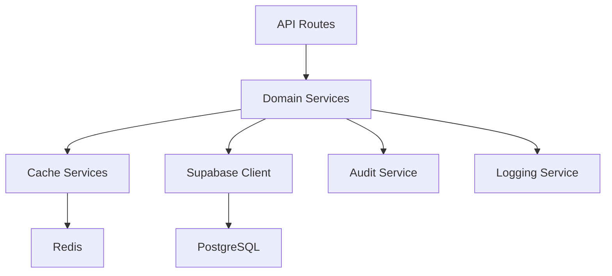

# Service Layer Architecture

**Author**: Maurice Rondeau
**Version**: 1.0.0
**Last Updated**: December 28, 2025

---

## Overview

The Fleet Management V2 application implements a **strict service layer pattern** where all database operations are encapsulated within service files. This architectural decision provides:

- **Separation of concerns**: UI components don't directly access the database
- **Testability**: Services can be mocked for unit testing
- **Reusability**: Business logic is centralized and reusable
- **Security**: Input validation and authorization happen at the service layer
- **Caching**: Redis and materialized view caching is transparent to consumers

```
┌─────────────────────────────────────────────────────────────┐
│                    Next.js 16 App Router                     │
├─────────────────┬─────────────────┬─────────────────────────┤
│  /dashboard/*   │   /portal/*     │        /api/*           │
│  (Admin Portal) │ (Pilot Portal)  │    (91+ Routes)         │
├─────────────────┴─────────────────┴─────────────────────────┤
│                   48 Service Layer Files                     │
│              lib/services/*.ts (~30k LoC)                    │
├─────────────────────────────────────────────────────────────┤
│  Redis Cache  │  Materialized Views  │  Supabase PostgreSQL │
└─────────────────────────────────────────────────────────────┘
```

---

## Usage Rules

### DO: Always use services for database operations

```typescript
// CORRECT - Use the service layer
import { getPilots } from '@/lib/services/pilot-service'
const pilots = await getPilots()

// CORRECT - Use service for mutations
import { createCertification } from '@/lib/services/certification-service'
await createCertification(pilotId, certData)
```

### DON'T: Make direct Supabase calls

```typescript
// WRONG - Bypasses service layer
import { createClient } from '@/lib/supabase/server'
const supabase = await createClient()
const { data } = await supabase.from('pilots').select('*')
```

---

## Service Categories

### Core Domain Services (10)

| Service                     | Purpose                           | Key Functions                                                        |
| --------------------------- | --------------------------------- | -------------------------------------------------------------------- |
| `pilot-service`             | Pilot profile management          | `getPilots()`, `getPilotById()`, `createPilot()`, `updatePilot()`    |
| `certification-service`     | Certification CRUD and compliance | `getCertifications()`, `createCertification()`, `getExpiringCerts()` |
| `unified-request-service`   | All leave/flight requests         | `getRequests()`, `createRequest()`, `approveRequest()`               |
| `flight-request-service`    | Flight-specific operations        | `getFlightRequests()`, `submitFlightRequest()`                       |
| `leave-eligibility-service` | Leave approval logic              | `checkEligibility()`, `calculateAvailability()`                      |
| `leave-bid-service`         | Annual leave bidding              | `getLeaveBids()`, `submitBid()`, `processBids()`                     |
| `task-service`              | Task management                   | `getTasks()`, `createTask()`, `updateTaskStatus()`                   |
| `disciplinary-service`      | Disciplinary records              | `getMatters()`, `createMatter()`, `addAction()`                      |
| `feedback-service`          | User feedback                     | `getFeedback()`, `submitFeedback()`                                  |
| `notification-service`      | System notifications              | `getNotifications()`, `createNotification()`, `markAsRead()`         |

### Dashboard & Analytics Services (5)

| Service                           | Purpose                            | Key Functions                                        |
| --------------------------------- | ---------------------------------- | ---------------------------------------------------- |
| `dashboard-service-v4`            | Main dashboard data (Redis-cached) | `getDashboardMetrics()`, `getFleetStats()`           |
| `analytics-service`               | Advanced analytics                 | `getRetirementForecasts()`, `getComplianceMetrics()` |
| `succession-planning-service`     | Succession pipeline                | `getSuccessionPipeline()`, `getRoleTransitions()`    |
| `retirement-forecast-service`     | Retirement projections             | `getForecast()`, `getYearlyBreakdown()`              |
| `expiring-certifications-service` | Expiry alerts                      | `getExpiringCerts()`, `getUrgentAlerts()`            |

### Authentication & Session Services (6)

| Service                       | Purpose                       | Key Functions                                               |
| ----------------------------- | ----------------------------- | ----------------------------------------------------------- |
| `pilot-portal-service`        | Pilot authentication (bcrypt) | `loginPilot()`, `registerPilot()`, `validateSession()`      |
| `session-service`             | Session management            | `createSession()`, `validateSession()`, `revokeSession()`   |
| `admin-auth-service`          | Admin authentication          | `validateAdminSession()`, `getAdminUser()`                  |
| `account-lockout-service`     | Security lockouts             | `checkLockout()`, `recordFailedAttempt()`, `resetLockout()` |
| `password-validation-service` | Password rules                | `validatePassword()`, `checkStrength()`                     |
| `user-service`                | User management               | `getUsers()`, `updateUser()`, `deleteUser()`                |

### Caching Services (3)

| Service                     | Purpose                   | Key Functions                                           |
| --------------------------- | ------------------------- | ------------------------------------------------------- |
| `redis-cache-service`       | Distributed Redis caching | `get()`, `set()`, `getOrSet()`, `delPattern()`          |
| `unified-cache-service`     | Unified cache interface   | `invalidateOnMutation()`, `warmCache()`                 |
| `cache-invalidation-helper` | Cache invalidation rules  | `invalidateAfterPilotUpdate()`, `invalidateDashboard()` |

### Reporting & Export Services (6)

| Service                  | Purpose               | Key Functions                                                       |
| ------------------------ | --------------------- | ------------------------------------------------------------------- |
| `reports-service`        | 19 report types       | `getLeaveReport()`, `getCertificationReport()`, `getFlightReport()` |
| `pdf-service`            | PDF generation        | `generatePDF()`, `createCertificationPDF()`                         |
| `export-service`         | CSV/Excel export      | `exportToCSV()`, `exportToExcel()`                                  |
| `roster-report-service`  | Roster period reports | `getRosterReport()`, `getCapacityReport()`                          |
| `roster-pdf-service`     | Roster PDF generation | `generateRosterPDF()`                                               |
| `leave-bids-pdf-service` | Leave bid exports     | `generateBidsPDF()`                                                 |

### Renewal Planning Services (2)

| Service                                  | Purpose                 | Key Functions                                                 |
| ---------------------------------------- | ----------------------- | ------------------------------------------------------------- |
| `certification-renewal-planning-service` | Renewal plan generation | `generatePlans()`, `getRosterPeriodSummary()`, `reschedule()` |
| `renewal-planning-pdf-service`           | Renewal plan exports    | `generatePlanPDF()`                                           |

### Roster & Scheduling Services (3)

| Service                         | Purpose                     | Key Functions                                                |
| ------------------------------- | --------------------------- | ------------------------------------------------------------ |
| `roster-period-service`         | Roster period management    | `getCurrentPeriod()`, `getPeriodByDate()`, `getAllPeriods()` |
| `roster-deadline-alert-service` | Deadline tracking           | `getUpcomingDeadlines()`, `getOverdueItems()`                |
| `conflict-detection-service`    | Schedule conflict detection | `detectConflicts()`, `checkAvailability()`                   |

### Pilot Portal Services (6)

| Service                       | Purpose               | Key Functions                                    |
| ----------------------------- | --------------------- | ------------------------------------------------ |
| `pilot-portal-service`        | Portal operations     | `getPilotStats()`, `getPilotCertifications()`    |
| `pilot-certification-service` | Pilot's cert view     | `getMyCertifications()`, `getUpcomingRenewals()` |
| `pilot-leave-service`         | Pilot leave requests  | `getMyLeaveRequests()`, `submitLeaveRequest()`   |
| `pilot-flight-service`        | Pilot flight requests | `getMyFlightRequests()`, `submitFlightRequest()` |
| `pilot-feedback-service`      | Pilot feedback        | `submitFeedback()`, `getMyFeedback()`            |
| `pilot-registration-service`  | Pilot registration    | `registerPilot()`, `getPendingRegistrations()`   |

### Email Services (2)

| Service                | Purpose              | Key Functions                                     |
| ---------------------- | -------------------- | ------------------------------------------------- |
| `pilot-email-service`  | Pilot notifications  | `sendExpiryAlert()`, `sendApprovalNotification()` |
| `notification-service` | In-app notifications | `createNotification()`, `sendBulkNotifications()` |

### Admin Services (3)

| Service                    | Purpose               | Key Functions                            |
| -------------------------- | --------------------- | ---------------------------------------- |
| `admin-service`            | Admin operations      | `getAdminStats()`, `getSystemSettings()` |
| `check-types-service`      | Check type management | `getCheckTypes()`, `createCheckType()`   |
| `account-deletion-service` | Account deletion      | `deleteAccount()`, `scheduleDeletion()`  |

### Supporting Services (2)

| Service               | Purpose             | Key Functions                                          |
| --------------------- | ------------------- | ------------------------------------------------------ |
| `audit-service`       | Audit logging       | `createAuditLog()`, `getAuditLogs()`, `getAuditById()` |
| `logging-service`     | Application logging | `logError()`, `logWarning()`, `logInfo()`              |
| `base-service`        | Shared utilities    | Error handling patterns, response types                |
| `leave-stats-service` | Leave statistics    | `getLeaveStats()`, `getYearlyUsage()`                  |

---

## Caching Strategy

### Triple-Layer Caching

```
Request → Redis (2-5ms) → Materialized View (10ms) → Raw Query (50-200ms)
```

1. **Redis Cache** (`redis-cache-service.ts`)
   - Distributed cache using Upstash
   - TTL-based expiration (1 min - 2 hours)
   - Pattern: `fleet:*`, `dashboard:*`, `ref:*`

2. **Materialized Views** (PostgreSQL)
   - `pilot_dashboard_metrics` - Pre-computed dashboard stats
   - Refreshed on data changes
   - 80x faster than raw queries

3. **Raw Queries** (Supabase)
   - Used when cache miss
   - Optimized with indexes
   - Connection pooling via Supabase

### Cache Keys

```typescript
// Key patterns from redis-cache-service.ts
CACHE_KEYS = {
  FLEET_STATS: 'fleet:stats',
  DASHBOARD_METRICS: 'dashboard:metrics:v3',
  CHECK_TYPES: 'ref:check_types',
  RENEWAL_SUMMARIES: (year) => `renewal:summaries:${year}`,
}
```

### TTL Configuration

| Data Type         | TTL       | Reason           |
| ----------------- | --------- | ---------------- |
| Reference data    | 2 hours   | Rarely changes   |
| Fleet statistics  | 5 minutes | Moderate updates |
| Dashboard metrics | 1 minute  | Near real-time   |
| Leave stats       | 2 minutes | Frequent changes |

---

## Service Response Pattern

All services return a consistent response type:

```typescript
interface ServiceResponse<T> {
  success: boolean
  data?: T
  error?: string
  metadata?: {
    count?: number
    page?: number
    totalPages?: number
  }
}
```

### Example Usage

```typescript
// In API route
const result = await getPilots({ page: 1, limit: 20 })

if (!result.success) {
  return NextResponse.json({ error: result.error }, { status: 500 })
}

return NextResponse.json(result.data)
```

---

## Error Handling

Services use the centralized error logger:

```typescript
import { logError, ErrorSeverity } from '@/lib/error-logger'

try {
  // Operation
} catch (error) {
  logError(error as Error, {
    source: 'service-name',
    severity: ErrorSeverity.HIGH,
    metadata: { operation: 'functionName', params: { ... } }
  })
  return { success: false, error: 'User-friendly message' }
}
```

### Severity Levels

| Level      | Use Case              |
| ---------- | --------------------- |
| `LOW`      | Non-critical warnings |
| `MEDIUM`   | Recoverable errors    |
| `HIGH`     | Critical failures     |
| `CRITICAL` | System-wide issues    |

---

## Testing Services

Services can be tested in isolation:

```typescript
// Unit test example
import { getPilots } from '@/lib/services/pilot-service'

describe('pilot-service', () => {
  it('should return paginated pilots', async () => {
    const result = await getPilots({ page: 1, limit: 10 })

    expect(result.success).toBe(true)
    expect(result.data).toHaveLength(10)
    expect(result.metadata?.page).toBe(1)
  })
})
```

---

## Adding New Services

1. Create file: `lib/services/{feature}-service.ts`
2. Add header with author and purpose
3. Import required dependencies
4. Implement functions returning `ServiceResponse<T>`
5. Add to this documentation
6. Create unit tests

### Template

```typescript
/**
 * {Feature} Service
 * Author: Maurice Rondeau
 * Date: {date}
 *
 * {Description}
 */

import { createClient } from '@/lib/supabase/server'
import { logError, ErrorSeverity } from '@/lib/error-logger'

export interface {Feature}Data {
  // Define types
}

export async function get{Feature}s(): Promise<ServiceResponse<{Feature}Data[]>> {
  try {
    const supabase = await createClient()

    const { data, error } = await supabase
      .from('table_name')
      .select('*')

    if (error) {
      logError(error, {
        source: '{feature}-service',
        severity: ErrorSeverity.MEDIUM,
        metadata: { function: 'get{Feature}s' }
      })
      return { success: false, error: error.message }
    }

    return { success: true, data }
  } catch (error) {
    logError(error as Error, {
      source: '{feature}-service',
      severity: ErrorSeverity.HIGH,
      metadata: { function: 'get{Feature}s' }
    })
    return { success: false, error: 'Failed to fetch data' }
  }
}
```

---

## Service Dependencies



---

## Performance Considerations

1. **Use batch queries** - Avoid N+1 patterns with `Promise.all()`
2. **Leverage caching** - Use `redis-cache-service` for expensive operations
3. **Optimize queries** - Use indexes, limit columns, pagination
4. **Log sparingly** - Use appropriate severity levels
5. **Handle errors gracefully** - Return user-friendly messages

---

## File Count Summary

| Category              | Count  |
| --------------------- | ------ |
| Core Domain           | 10     |
| Dashboard & Analytics | 5      |
| Authentication        | 6      |
| Caching               | 3      |
| Reporting             | 6      |
| Renewal Planning      | 2      |
| Roster & Scheduling   | 3      |
| Pilot Portal          | 6      |
| Email                 | 2      |
| Admin                 | 3      |
| Supporting            | 4      |
| **Total**             | **48** |
